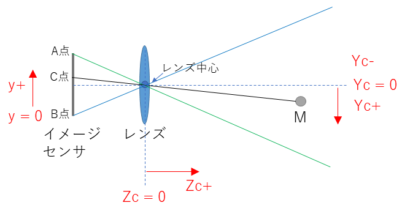
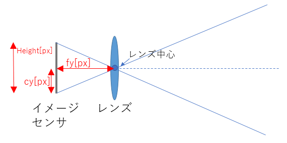
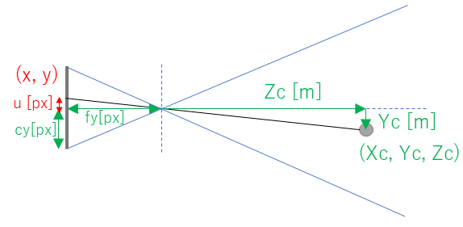
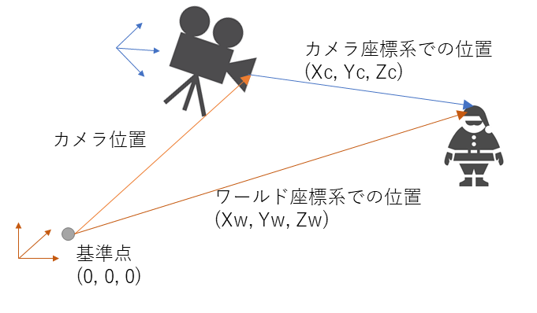

# OpenCVとピンホールカメラモデルを用いて、3D空間でグリグリする

# この記事について
- 自分で作った3D空間をマウス操作で自由に移動できるコードを作ります。UnityやOpenGLのデモでよくありますが、今回使用するライブラリはOpenCVだけです
- ピンホールカメラモデルを理解しながら、自分で行列式を書き、3D空間→2D平面へ投影します。OpenCVは結果の描画にだけ使います


[demo_video]

## 環境
### 環境 (Windows)
- Core i7-11700 @ 2.5GHz x 6 cores (16 processors)
- Windows 11 Home
- Visual Studio 2019
- cmake-gui
- OpenCV 4.5.4
    - https://github.com/opencv/opencv/releases/download/4.5.4/opencv-4.5.4-vc14_vc15.exe

### 環境 (Linux)
- Core i7-11700 @ 2.5GHz x 6 cores (16 processors)
- Ubuntu 20.04
- apt install build-essential cmake libopencv-dev

## コードの場所
https://github.com/iwatake2222/opencv_sample/00_article/00_camera_model

## プロジェクト構造
- 本題に集中するため、OpenCVの使い方や、プロジェクトへのリンク方法などは説明しません
- 以下のようなプロジェクト構成としました。この記事では`projection_points_3d_to_2d` というプロジェクトについてのみ記載しますが、実際にはいろいろなプロジェクトを同時にビルドするようになっています。
    - {root}
        - CMakeLists.txt : 全体のcmake。共通モジュールと各プロジェクトをビルドする。OpenCVに関する設定もする
        - common : 各プロジェクトで共通のモジュール
            - camera_model.h : ピンホールカメラモデル用のクラス。カメラパラメータを格納し、変換用の関数などを提供する
        - projection_points_3d_to_2d: 本記事で説明するプロジェクト。3D空間をグリグリする
            - main.cpp : メインとなる処理
            - CMakeLists.txt : `projection_points_3d_to_2d` プロジェクト用のcmake
        - {others} : 他のプロジェクト達

```cmake:{root}/CMakeLists.txt
cmake_minimum_required(VERSION 3.0)

project(opencv_sample)

set(CMAKE_C_STANDARD 11)
set(CMAKE_CXX_STANDARD 14)

find_package(OpenCV REQUIRED)
include_directories(${OpenCV_INCLUDE_DIRS})
link_libraries(${OpenCV_LIBS})

include_directories(common)
add_subdirectory(common)

add_subdirectory(projection_image_3d_to_2d)
add_subdirectory(略)
```

```cmake:{root}/projection_points_3d_to_2d/CMakeLists.txt
add_executable(projection_points_3d_to_2d main.cpp)
```


# ピンホールカメラモデル (カメラ位置を基準に)
- カメラモデルとは、そのカメラで3次元空間中の物体が画像上のどこに投影されるかを表現したモデルです
- ここではシンプルかつ広く使われているピンホールカメラモデルについて扱います
- まず、カメラで人を撮影するシーンを考えます (下図の上)
- このとき「カメラ」は「イメージセンサ」と「レンズ」という部品に分解できます。また、「人」も、ひとまずは3D空間上の1点として考えます。カメラを真横から見た場合の図が下記になります。(後の説明のために、レンズの中心点(光学中心 = optical center, カメラ中心 = camera center)と光軸(点線)も書いています)


- 太陽光などが3D空間上にある物体に反射し、レンズの中心(ピンホール)をイメージセンサに到達します。その結果、2D平面上に画像が得られます
    - 今回の場合、対象点はイメージセンサ上のC点に到達します
    - また、物理的な設置位置で上部になるA点は、緑の線上を通り光を受けます
    - また、物理的な設置位置で下部になるB点は、青の線上を通り光を受けます
    - つまり、イメージセンサ上では上下が反転することが分かります
    - 他の本や記事の説明では、この後、上下反転を扱いやすくするために虚像平面という概念を持ち出していますが、本記事ではこのまま説明します
        - (個人的には虚像平面という考えが出てくるせいで、初見の時は混乱しました。。。)


## ピンホールカメラモデル、OpenCVで使う座標系
- 画像上の座標は、OpenCvでは左上が(0,0)で、右下に行くとプラスになります。この画像上の座標を(x, y) [px] と呼ぶことにします
- レンズ中心を原点(0, 0, 0)とした3D空間上の座標を(Xc, Yc, Zc) [m] と呼ぶことにします
    - 後々出てきますがこれはカメラ座標系と呼ばれるものになります
    - イメージしやすいように単位として[m]をつけましたが、実際は[mm]でもよいです
- (Xc, Yc, Z,)の正負ですが、OpenCVでは以下のようになります (右手系と呼ばれるものです)
    - Xc: イメージセンサからレンズの方を向いて、右側がプラス
    - Yc: イメージセンサからレンズの方を向いて、下側がプラス
    - Zc: イメージセンサからレンズの方を向いて、奥がプラス
    - このようにすることによって、例えばYを例にとると、カメラ座標系で物体が下にいくにつれて(Yc+)、画像上でも物体が下にいくようになります(y+)
    - 横方向(X)についても同様に扱いやすくなります。横方向について考えるときは、カメラを上から見た場合をイメージしてみてください。




## ピンホールカメラモデルのパラメータ
- Width, Height [px]: 画像サイズ
- cx, cy [px]: 主点 (Principal point)
    - 画像の原点((x, y) = (0, 0)[px])から、レンズの中心軸と画像の交点、への距離(ずれ) [px]
    - ほとんどの場合、画像の中心(Width/2, Height/2)の近くだが、少しずれていることもある
    - カメラの内部パラメータと呼ばれるもの
    - キャリブレーションツールが出力してくれる。困ったら(Width/2, Height/2)としておけばとりあえず動く
- fx, fy [px]: 焦点距離 (Focal Length [px])
    - 光学中心からイメージセンサまでの距離。ほとんどの場合、fx = fy (イメージセンサの各撮像素子のアスペクトが1:1じゃない場合などはfx != fy)
    - 単位にピクセルを使うのは、扱いやすくするため
    - カメラの内部パラメータと呼ばれるもの
    - キャリブレーションツールが出力してくれるが、画角(FoV[deg])からも算出可能
        - fx = cx / tan(HFoV / 2), fy = cy / tan(VFoV / 2)
- k1, k2, k3, k4, k5: レンズ歪パラメータ
    - 後ほど、いよいよイメージセンサ上にどのように投影されるかを説明しますが、実際には単純な計算式通りにはならず、レンズを通る際に少し歪が発生します
    - その歪を表現するパラメータになるのですが、本記事では省略します




## (Xc, Yc, Zc) から 画像平面への投影
- カメラ座標系で(Xc, Yc, Zc) [m]が、画像平面でどの位置(x, y)[px] に投影されるかを計算します
- 下図において、(Xc, Yc, Zc) は既知として、(x, y)を求める計算になります。なお、簡略化のためレンズなどの図は削除しました


- カメラ内部パラメータも既知であるとし、重ね合わせます。また、cyから求めたい点yまでの距離を仮にu[px] とおきます



- すると、2つの相似する三角形が出来るかと思います。この相似関係を使い、u [px] を求めることができます
    - u : fy = Yc : Zc
    - u = fy * Yc / Zc [px]
- 結果として、
    - y = u + cy = fy * Yc / Zc + cy [px]
- xについても同様に以下のように計算できます
    - x = v + cx = fx * Yx / Zc + cx [px]

## カメラの内部パラメータを用いて変換を行列で表す
上記のx, yを求める計算式を行列で書き直すと下記のようになります。ちょっと見た目が変わっていますが、行列式としては扱いやすいようになっています。この行列式を解くと、上記と同じになることがわかると思います。また、急にsという変数が出てきていますが、これも3行目について解くとx = Zcとなることがわかります。

$$
s\left(
\begin{matrix} 
x \\ 
y \\
1
\end{matrix} 
\right)
=
\left(
\begin{matrix} 
fx & 0 & cx \\ 
 0 & fy & cy \\ 
 0 &  0 & 1 \\ 
\end{matrix} 
\right)
\left(
\begin{matrix} 
Xc \\ 
Yc \\ 
Zc \\ 
\end{matrix} 
\right)
=
K
Mc
$$

$$
K = 
\left(
\begin{matrix} 
fx & 0 & cx \\ 
 0 & fy & cy \\ 
 0 &  0 & 1 \\ 
\end{matrix} 
\right)
, Mc = 
\left(
\begin{matrix} 
Xc \\ 
Yc \\ 
Zc \\ 
\end{matrix} 
\right)
$$

# ピンホールカメラモデル (絶対位置を基準に)
- ここまでの説明では、対象物体の座標はカメラ中心を基準とした、カメラ座標系と呼ばれるものでした(Xc, Yc, Zc)
- しかし、ある基準点を原点とした位置で扱いたいことのほうが多いと思います。また、カメラ座標系位置だけではなく座標軸もイメージセンサに水平、垂直、鉛直となります。そのため、カメラが傾いている場合など、扱いづらくなることもあります
- ある基準点を原点とした座標系をワールド座標系と呼びます (Xw, Yw, Zw)
- ここからは、ワールド座標系での位置 (Xw, Yw, Zw)から、画像上への撮像(x,y)について考えます



- 上の図を簡略化したものが下記になります
    - Ow: ワールド座標系の原点
    - Oc: カメラ座標系の原点
    - (Xw, Yw, Zw): ワールド座標系での物体Mの座標 (Mw)
        - 既知とする
    - (Xc, Yc, Zc): カメラ座標系での物体Mの座標 (Mc)
        - 未知とする
    - (Txw, Tyw, Tzw): ワールド座標系でのカメラの位置(Oc - Ow)
        - 既知とする
        - カメラの外部パラメータと呼ばれるもの
    - (rx, ry, rz): カメラ座標系がワールド座標系に対してどのように回転しているか (カメラの姿勢)
        - 既知とする
        - 実際にはこの3つの角度から、回転行列Rを計算し、そのRを使う
        - カメラの外部パラメータと呼ばれるもの


- 最終目標は画像上への撮像(x,y)なので、先ほどの計算式を使うため、まずはすべてをカメラ座標系に変換するのがよさそうです
    - (u v) = K x Mc = K x 何らかの変換(Mw)
    - 上の何らかの変換を考えます
- 図を見ると、Mc = Mw - T だと直感的に見えます。が、実際にはMcはカメラ座標系になります。(rx, ry, rz)だけ軸が回転しています。この回転を補正するために(rx, ry, rz)から計算される回転行列Rを左からかけてあげる必要があります
    - Mc = R x (Mw - T) = R x Mw - R x T
- ここで、 t = -R x T とおくことで以下のようにできます
    - Mc = R x Mw + t
    - このtの意味は、カメラ座標系でのOw - Oc (カメラ座標系原点からワールド座標系原点) となります
- 式をさらに扱いやすくすると、
    - Mc = (R t) x (Mw 1)

$$
Mc = 
\left(
\begin{matrix} 
Xc \\ 
Yc \\ 
Zc \\ 
\end{matrix} 
\right)
= 
\left(
\begin{matrix} 
R11 & R12 & R13 && tx \\ 
R21 & R22 & R23 && ty \\ 
R31 & R32 & R33 && tz \\ 
\end{matrix} 
\right)
\left(
\begin{matrix} 
Xw \\ 
Yw \\ 
Zw \\ 
1 \\ 
\end{matrix} 
\right)
= 
\left(
\begin{matrix} 
R & | & t \\ 
\end{matrix} 
\right)
\left(
\begin{matrix} 
Mw \\ 
1 \\ 
\end{matrix} 
\right)
$$

- 先ほどのカメラ座標系での変換式と合わせると以下のようになります

$$
s\left(
\begin{matrix} 
x \\ 
y \\
1
\end{matrix} 
\right)
=
\left(
\begin{matrix} 
fx & 0 & cx \\ 
 0 & fy & cy \\ 
 0 &  0 & 1 \\ 
\end{matrix} 
\right)
\left(
\begin{matrix} 
R11 & R12 & R13 && tx \\ 
R21 & R22 & R23 && ty \\ 
R31 & R32 & R33 && tz \\ 
\end{matrix} 
\right)
\left(
\begin{matrix} 
Xw \\ 
Yw \\ 
Zw \\ 
1 \\ 
\end{matrix} 
\right)
=
K
\left(
\begin{matrix} 
R & | & t \\ 
\end{matrix} 
\right)
\left(
\begin{matrix} 
Mw \\ 
1 \\ 
\end{matrix} 
\right)
$$

# コードにする
## カメラパラメータを格納する
- `CameraModel` というクラスを作り、その中に内部パラメータ(K)と、外部パラメータ(R, t)を格納することにします。Rは回転行列ですが、格納する際は各軸の回転を現した3次元のベクトル(rvec)で保存することにしました
- `SetExtrinsic` 関数によって外部パラメータを設定できます。この時、先ほど説明した通りtvecは「カメラ座標系でのOw - Oc (カメラ座標系原点からワールド座標系原点)」となります。これだと直感的に使いづらいので、ワールド座標系での入力もできるようにしています。`is_t_on_world` フラグがtrueの場合は、この関数内で変換をしています

```cpp:camera_model.h
class CameraModel {
public:
    /* Intrinsic parameter */
    /* float, 3 x 3 */
    cv::Mat K;

    int32_t width;
    int32_t height;

    /* Extrinsic parameter */
    /* float, 3 x 1, pitch,  yaw, roll [rad] */
    cv::Mat rvec;

    /* float, 3 x 1, (X, Y, Z): horizontal, vertical, depth (Camera location: Ow - Oc in camera coordinate) */
    cv::Mat tvec;

    void SetIntrinsic(int32_t _width, int32_t _height, float focal_length)
    {
        width = _width;
        height = _height;
        K = (cv::Mat_<float>(3, 3) <<
            focal_length,            0,  width / 2.f,
                        0, focal_length, height / 2.f,
                        0,            0,            1);
    }

    void SetExtrinsic(const std::array<float, 3>& r_deg, const std::array<float, 3>& t, bool is_t_on_world = true)
    {
        rvec = (cv::Mat_<float>(3, 1) << Deg2Rad(r_deg[0]), Deg2Rad(r_deg[1]), Deg2Rad(r_deg[2]));
        tvec = (cv::Mat_<float>(3, 1) << t[0], t[1], t[2]);

        if (is_t_on_world) {
            cv::Mat R;
            cv::Rodrigues(rvec, R);
            tvec = -R * tvec;   /* t = -RT */
        }
    }
}
```


## ワールド座標系から画像座標系へ変換するする「
- `ProjectWorld2Image` という関数で、`cv::Point3f` 型のMw(ワールド座標系での座標)を、`cv::Point2f` 型の画像上での座標に変換します。複数の点を同時に変換でいるよう、vectorになっています
- 行っている計算は、先ほど算出した通りのものとなります
- が、一点だけ実装上の工夫があります。いっぺんに計算するのではなく、一度MwからMcに変換しています。そして、Zc(カメラ座標上での奥行)を確認し、カメラより後方にある点は変換しないようにしています。これをそのまま計算してしまうと、カメラの裏側にある点が変な位置に表示されてしまいます

```cpp:camera_model.h
class CameraModel {
    略

    void ProjectWorld2Image(const std::vector<cv::Point3f>& object_point_list, std::vector<cv::Point2f>& image_point_list)
    {
        /*** Projection ***/
        /* s[x, y, 1] = K * [R t] * [M, 1] = K * M_from_cam */
        cv::Mat K = parameter.K;
        cv::Mat R = MakeRotateMat(Rad2Deg(parameter.pitch()), Rad2Deg(parameter.yaw()), Rad2Deg(parameter.roll()));
        cv::Mat Rt = (cv::Mat_<float>(3, 4) <<
            R.at<float>(0), R.at<float>(1), R.at<float>(2), parameter.x(),
            R.at<float>(3), R.at<float>(4), R.at<float>(5), parameter.y(),
            R.at<float>(6), R.at<float>(7), R.at<float>(8), parameter.z());

        image_point_list.resize(object_point_list.size());

        for (int32_t i = 0; i < object_point_list.size(); i++) {
            const auto& object_point = object_point_list[i];
            auto& image_point = image_point_list[i];
            cv::Mat Mw = (cv::Mat_<float>(4, 1) << object_point.x, object_point.y, object_point.z, 1);
            cv::Mat Mc = Rt * Mw;
            float Zc = Mc.at<float>(2);
            if (Zc <= 0) {
                /* Do not project points behind the camera */
                image_point = cv::Point2f(-1, -1);
                continue;
            }

            cv::Mat UV = K * Mc;
            float x = UV.at<float>(0);
            float y = UV.at<float>(1);
            float s = UV.at<float>(2);
            x /= s;
            y /= s;

            image_point.x = x;
            image_point.y = y;
        }
    }
}
```

# 実行コードを作る
## 地面を作る

- `ResetCamera` 関数でカメラパラメータを設定しています。以下のカメラを想定しています
    - 1280 x 720、画角は80度
    - 地面から高さ10mの位置に、水平に設置

- `loop_main` が毎フレームの処理です
    - ワールド座標上で、幅5m間隔、奥行き100mの点群を作り、`object_point_list` に格納します
    - その後、先ほど作成した `ProjectWorld2Image` 関数を呼び、画像上での点に変換します
    - 最後にその点をOpenCVの `cv::circle` で描画しています

- `CallbackMouseMain` がマウス操作が発生したときの処理です
    - 「マウスでグリグリさせる」というのは、結局はマウス操作に合わせてカメラの角度を変えることになります
    - マウスを横方向に動かしたらyaw角、縦方向に動かしたらpitch角を変えます
    - `SetExtrinsic` 同等のことを行えばいいのですが、rvecを所定の角度だけ変化させる関数 `RotateCameraAngle` を用意したのでここではそれを呼びます

- `TreatKeyInputMain` がキーボード入力が発生したときの処理です
    - FPSゲームのように、ASDWキーであたかも動いているかのようにします
    - そのためには、各キーを押されたら、それに合わせてtvecを動かせばよいことになります
    - 回転と同様に`SetExtrinsic` 同等のことを行えばいいのですが、tvecを所定の量だけ変化させる関数 `MoveCameraPos` を用意したのでここではそれを呼びます

```cpp:main.cpp
/*** Macro ***/
static constexpr char kWindowMain[] = "WindowMain";

static constexpr int32_t kWidth  = 1280;
static constexpr int32_t kHeight = 720;
static constexpr float   kFovDeg = 80.0f;

static constexpr int32_t kPointRange  = 100;
static constexpr float kPointInterval = 5.0f;
static constexpr int32_t kPointNum    = static_cast<int32_t>(kPointRange / kPointInterval) + 1;

/*** Global variable ***/
static CameraModel camera;


void ResetCamera(int32_t width, int32_t height)
{
    camera.SetIntrinsic(width, height, CameraModel::FocalLength(width, kFovDeg));
    camera.SetExtrinsic(
        { 0.0f, 0.0f, 0.0f },    /* rvec [deg] */
        //{ 0.0f, 10.0f, 0.0f }, false);   /* tvec (Oc - Ow in world coordinate. X+= Right, Y+ = down, Z+ = far) */
        { 0.0f, -10.0f, 0.0f }, true);   /* tvec (Oc - Ow in world coordinate. X+= Right, Y+ = down, Z+ = far) */
}


static bool CheckIfPointInArea(const cv::Point& p, const cv::Size& r)
{
    if (p.x < 0 || p.y < 0 || p.x >= r.width || p.y >= r.height) return false;
    return true;
}

static void loop_main()
{
    /* Generate object points (3D: world coordinate) */
    std::vector<cv::Point3f> object_point_list;
    for (float x = -kPointRange; x <= kPointRange; x += kPointInterval) {
        for (float y = -kPointRange; y <= kPointRange; y += kPointInterval) {
            object_point_list.push_back(cv::Point3f(x, y, 0));
        }
    }

    /* Convert to image points (2D) */
    std::vector<cv::Point2f> image_point_list;
    camera.ProjectWorld2Image(object_point_list, image_point_list);

    /* Draw the result */
    cv::Mat mat_output = cv::Mat(kHeight, kWidth, CV_8UC3, cv::Scalar(70, 70, 70));
    for (int32_t i = 0; i < image_point_list.size(); i++) {
        if (CheckIfPointInArea(image_point_list[i], mat_output.size())) {
            if (i % kPointNum != 0) {
                cv::line(mat_output, image_point_list[i - 1], image_point_list[i], cv::Scalar(220, 0, 0));
            }
            cv::circle(mat_output, image_point_list[i], 2, cv::Scalar(220, 0, 0));
            cv::putText(mat_output, std::to_string(i), image_point_list[i], 0, 0.4, cv::Scalar(0, 255, 0));
        }
    }

    cv::imshow(kWindowMain, mat_output);
}

static void CallbackMouseMain(int32_t event, int32_t x, int32_t y, int32_t flags, void* userdata)
{
    static constexpr float kIncAnglePerPx = 0.1f;
    static constexpr int32_t kInvalidValue = -99999;
    static cv::Point s_drag_previous_point = { kInvalidValue, kInvalidValue };
    if (event == cv::EVENT_LBUTTONUP) {
        s_drag_previous_point.x = kInvalidValue;
        s_drag_previous_point.y = kInvalidValue;
    } else if (event == cv::EVENT_LBUTTONDOWN) {
        s_drag_previous_point.x = x;
        s_drag_previous_point.y = y;
    } else {
        if (s_drag_previous_point.x != kInvalidValue) {
            float delta_yaw = kIncAnglePerPx * (x - s_drag_previous_point.x);
            float pitch_delta = -kIncAnglePerPx * (y - s_drag_previous_point.y);
            camera.parameter.RotateCameraAngle(pitch_delta, delta_yaw, 0);
            s_drag_previous_point.x = x;
            s_drag_previous_point.y = y;
        }
    }
}


static void TreatKeyInputMain(int32_t key)
{
    static constexpr float kIncPosPerFrame = 0.8f;
    key &= 0xFF;
    switch (key) {
    case 'w':
        camera.parameter.MoveCameraPos(0, 0, kIncPosPerFrame, false);
        break;
    case 'W':
        camera.parameter.MoveCameraPos(0, 0, kIncPosPerFrame, true);
        break;
    case 's':
        camera.parameter.MoveCameraPos(0, 0, -kIncPosPerFrame, false);
        break;
    case 'S':
        camera.parameter.MoveCameraPos(0, 0, -kIncPosPerFrame, true);
        break;
    case 'a':
        camera.parameter.MoveCameraPos(-kIncPosPerFrame, 0, 0, false);
        break;
    case 'A':
        camera.parameter.MoveCameraPos(-kIncPosPerFrame, 0, 0, true);
        break;
    case 'd':
        camera.parameter.MoveCameraPos(kIncPosPerFrame, 0, 0, false);
        break;
    case 'D':
        camera.parameter.MoveCameraPos(kIncPosPerFrame, 0, 0, true);
        break;
    case 'z':
        camera.parameter.MoveCameraPos(0, -kIncPosPerFrame, 0, false);
        break;
    case 'Z':
        camera.parameter.MoveCameraPos(0, -kIncPosPerFrame, 0, true);
        break;
    case 'x':
        camera.parameter.MoveCameraPos(0, kIncPosPerFrame, 0, false);
        break;
    case 'X':
        camera.parameter.MoveCameraPos(0, kIncPosPerFrame, 0, true);
        break;
    case 'q':
        camera.parameter.RotateCameraAngle(0, 0, 2.0f);
        break;
    case 'e':
        camera.parameter.RotateCameraAngle(0, 0, -2.0f);
        break;
    }
}

int main(int argc, char* argv[])
{
    cv::setMouseCallback(kWindowMain, CallbackMouseMain);

    ResetCamera(kWidth, kHeight);

    while (true) {
        loop_main();
        int32_t key = cv::waitKey(1);
        if (key == 27) break;   /* ESC to quit */
        TreatKeyInputMain(key);
    }

    return 0;
}
```

## OpenCVの機能で変換する
- ここまで頑張って変換式を立てて、実装に落とし込んできましたが、それOpenCVで用意されています。`cv::projectPoints` という関数です
- `ProjectWorld2Image` 関数の中身はたった1行で以下のように書き換えられます

```cpp:camera_model.h
class CameraModel {
    略

    void ProjectWorld2Image(const std::vector<cv::Point3f>& object_point_list, std::vector<cv::Point2f>& image_point_list)
    {
        cv::projectPoints(object_point_list, rvec, tvec, K, dist_coeff, image_point_list);
    }
```

# 
- ピンホールカメラモデルの説明をしているサイトはたくさんあったのですが、コードまで落とし込んでいるサイトは少なかったので楽しめるアプリを作れるところまでをやってみました
- 変換自体は、最終的にはOpenCVの関数1つで出来てしまうという悲しい結果になってしまいました。
- この計算式を使うことで、色々なことに応用ができます
    - $$
s\left(
\begin{matrix} 
x \\ 
y \\
1
\end{matrix} 
\right)
=
K
\left(
\begin{matrix} 
R & | & t \\ 
\end{matrix} 
\right)
\left(
\begin{matrix} 
Mw \\ 
1 \\ 
\end{matrix} 
\right)
$$ 
- 例えば、鳥観図変換や3D再構築、距離計算などに応用できます

## 応用例
- https://github.com/iwatake2222/opencv_sample では、色々な応用例を紹介しているので興味がある方はぜひご覧になってください
- 距離計算
- 鳥観図変換
- 3D再構築
