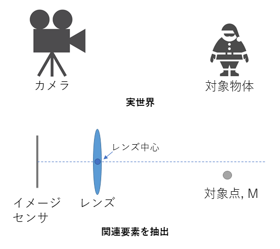
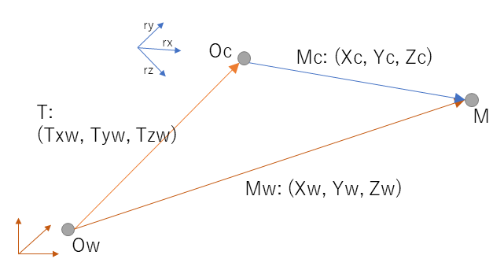

# OpenCVとピンホールカメラモデルを用いて、3D空間でグリグリする

# この記事について
- 3D空間をマウス操作で自由に移動できるコードを作ります。UnityやOpenGLのデモでよくありそうなやつですが、ここではOpenCVを使います
- ピンホールカメラモデルを理解しながら、自分で変換式を書き、3D空間→2D平面へ投影します。OpenCVは行列計算と結果の描画にだけ使います

https://user-images.githubusercontent.com/11009876/144704158-cf3e2409-eba7-4e4d-aace-ac85c3072003.mp4


## 環境
### 環境 (Windows)
- Core i7-11700 @ 2.5GHz x 8 cores (16 processors)
- Windows 11 Home
- Visual Studio 2019
- cmake-gui
- OpenCV 4.5.4
    - https://github.com/opencv/opencv/releases/download/4.5.4/opencv-4.5.4-vc14_vc15.exe

### 環境 (Linux)
- Core i7-11700 @ 2.5GHz x 8 cores (16 processors)
- Ubuntu 20.04 (5.10.16.3-microsoft-standard-WSL2)
- apt install build-essential cmake libopencv-dev

## コードの場所
https://github.com/iwatake2222/opencv_sample/tree/master/01_article/00_camera_model

### プロジェクト構造
- 00_camera_model/
    - CMakeLists.txt
    - main.cpp
        - 描画処理や、キーボード・マウス入力をする
    - camera_model.h
        - ピンホールカメラモデル用のクラス。カメラパラメータを格納し、変換用の関数などを提供する

```cmake:CMakeLists.txt
cmake_minimum_required(VERSION 3.0)

project(main)

set(CMAKE_C_STANDARD 11)
set(CMAKE_CXX_STANDARD 14)

find_package(OpenCV REQUIRED)
include_directories(${OpenCV_INCLUDE_DIRS})
link_libraries(${OpenCV_LIBS})

add_executable(main main.cpp camera_model.h)
```


# ピンホールカメラモデル
## カメラ位置を原点とする3D空間の点を、2D画像上に投影する (カメラ座標系→画像座標系)
### やりたいこと
- 目的は、あるカメラで3次元空間中の物体を映した場合に、画像上のどこに投影かを知ることです
- カメラモデルとは、それを表現したモデルです
- ここではシンプルかつ広く使われているピンホールカメラモデルについて扱います
- まず、カメラで人を撮影するシーンを考えます (下図の上)
- このとき「カメラ」は「イメージセンサ」と「レンズ」という部品に分解できます。また、「人」も、ひとまずは3D空間上の1点として考えます。カメラを真横から見た場合の図が下記になります。(後の説明のために、レンズの中心点(光学中心 = optical center, カメラ中心 = camera center)と光軸(点線)も書いています)
- 今後、図は全てカメラを横から見た場合の図になります



- 太陽光などが3D空間上にある物体に反射し、レンズの中心(ピンホール)を通りイメージセンサに到達します。その結果、2D平面上に画像が得られます
    - 今回の場合、対象点Mはイメージセンサ上のC点に到達します
    - また、イメージセンサ上で最上部にあるA点は、緑の線上を通る光を受けます。そのため、A点は3D空間上では下の方にある光を受けます
    - また、イメージセンサ上で最下部になるB点は、青の線上を通る光を受けます。そのため、B点は3D空間上では上の方にある光を受けます
    - つまり、イメージセンサ上では上下が反転することが分かります
    - ※他の本や記事の説明では、この後、上下反転を扱いやすくするために虚像平面という概念を持ち出している場合がありますが、本記事ではこのまま説明します
        - (個人的にはこのままのほうが理解しやすく、自分は初見の時に虚像平面という考え方のせいで混乱してしまったので。。。)


### 画像座標系とカメラ座標系
- 画像上の座標は、OpenCVでは左上が(0,0)で、右下に行くとプラスになります。これを画像座標系 (x, y) [px] と呼ぶことにします
    - 先ほどの図でいうと、B点がy=0[px]、A点はy=height[px]になります
- レンズ中心を原点(0, 0, 0)とした3D空間上の座標を(Xc, Yc, Zc) [m] と呼ぶことにします
    - 各軸はレンズに対して水平、垂直、鉛直とします
    - この座標系は、カメラ座標系と呼ばれます
    - イメージしやすいように単位として[m]をつけましたが、実際は[mm]でもよいです
- (Xc, Yc, Zc)の正負ですが、OpenCVでは以下のようになります (右手系と呼ばれるものです)
    - Xc: イメージセンサからレンズの方を向いて、右側がプラス
    - Yc: イメージセンサからレンズの方を向いて、下側がプラス
    - Zc: イメージセンサからレンズの方を向いて、奥がプラス
    - このようにすることによって、例えばYを例にとると、カメラ座標系で物体が下に行く(Ycが+方向に行く)につれて、画像上でも物体が下にいくようになります(yも+方向に行く)
    - 横方向(X)についても同様に扱いやすくなります。横方向について考えるときは、カメラを上から見た場合をイメージしてみてください。


### ピンホールカメラモデルのパラメータ
- Width, Height [px]: 画像サイズ
- cx, cy [px]: 主点 (Principal point)
    - レンズの中心軸とイメージセンサの交点、の画像座標系での位置
    - ほとんどの場合、画像の中心(Width/2, Height/2)の近くだが、少しずれていることもある
    - カメラの内部パラメータの一部
    - キャリブレーションツールが出力してくれる。困ったら(Width/2, Height/2)としておけばとりあえず動く
- fx, fy [px]: 焦点距離 (Focal length)
    - 光学中心からイメージセンサまでの距離。ほとんどの場合、fx = fy (イメージセンサの各撮像素子のアスペクトが1:1じゃない場合などはfx != fy)
    - 単位にピクセルを使うのは、扱いやすくするためです
        - 1画素素子当たりのサイズ[m]が分かれば、焦点距離[m]から焦点距離[px]へは変換可能
    - カメラの内部パラメータの一部
    - キャリブレーションツールが出力してくれるが、画角(FoV[deg])からも算出可能
        - fx = cx / tan(HFoV / 2), fy = cy / tan(VFoV / 2)
- k1, k2, k3, k4, k5: レンズ歪パラメータ
    - 後ほどいよいよイメージセンサ上にどのように投影されるかを説明しますが、実際には単純な計算式通りにはならず、レンズを通る際に少し歪が発生します
    - その歪を表現するパラメータになるのですが、本記事では省略します


### 投影変換 (カメラ座標系→画像座標系)
- 今の時点での目的は、カメラ座標系のある点(Xc, Yc, Zc) [m]が、画像座標系でどの位置(x, y)[px] に投影されるかを知ることです
- 下図において、(Xc, Yc, Zc) は既知として、(x, y)を求める、というのがやりたいことです。なお、簡略化のためレンズなどの図は削除しました


- カメラ内部パラメータも既知であるとし、重ね合わせます。また、cyから求めたい点yまでの距離を仮にu[px] とおきます


- すると、2つの相似する三角形が出来るかと思います。この相似関係を使い、u [px] を求めることができます
    - u : fy = Yc : Zc
    - ⇒ u = fy * Yc / Zc [px]
- 結果として、
    - y = u + cy = fy * Yc / Zc + cy [px]
- xについても同様に以下のように計算できます
    - x = v + cx = fx * Yx / Zc + cx [px]

### 投影変換行列 (カメラ座標系→画像座標系)
- 上記のx, yを求める計算式を行列で書き直すと下記のようになります。ちょっと見た目が変わっていますが、入力を(Xc, Yc, Zc)のベクトルとすることで扱いやすくなります
- 式を解くと、上記と同じになることがわかると思います。また、急にsという変数が出てきていますが、これも3行目について解くとs = Zcとなることがわかります
    - $
s\left(
\begin{matrix} 
x \\ 
y \\
1
\end{matrix} 
\right)
=
\left(
\begin{matrix} 
fx & 0 & cx \\ 
 0 & fy & cy \\ 
 0 &  0 & 1 \\ 
\end{matrix} 
\right)
\left(
\begin{matrix} 
Xc \\ 
Yc \\ 
Zc \\ 
\end{matrix} 
\right)
=
K \times
Mc
$

    - $
ここで、
K = 
\left(
\begin{matrix} 
fx & 0 & cx \\ 
 0 & fy & cy \\ 
 0 &  0 & 1 \\ 
\end{matrix} 
\right) = カメラの内部パラメータ
、　　 Mc = 
\left(
\begin{matrix} 
Xc \\ 
Yc \\ 
Zc \\ 
\end{matrix} 
\right) = カメラ座標系における3D位置ベクトル
$

## 任意の点を原点とする3D空間の点を、2D画像上に投影する (ワールド座標系→カメラ座標系→画像座標系)
- ここまでの説明では、対象物体の座標はカメラ中心を基準とした、カメラ座標系と呼ばれるものでした(Xc, Yc, Zc)
- しかし、ある基準点を原点とした位置で扱いたいことのほうが多いと思います。また、カメラ座標系だと、原点だけではなく座標軸もイメージセンサに水平、垂直、鉛直となります。そのため、カメラが傾いている場合など、扱いづらくなることもあります
- ある基準点を原点とし、ある座標軸に基づいた座標系をワールド座標系と呼びます (Xw, Yw, Zw)
- ここからは、ワールド座標系での位置 (Xw, Yw, Zw)から、画像座標系への変換することを目的とします。これが最終目的です


- 上の図を簡略化したものが下記になります
    - Ow: ワールド座標系の原点
    - Oc: カメラ座標系の原点
    - (Xw, Yw, Zw): ワールド座標系での物体Mの座標 (Mw)
        - 既知とする
    - (Xc, Yc, Zc): カメラ座標系での物体Mの座標 (Mc)
        - 未知とする
    - (Txw, Tyw, Tzw): ワールド座標系でのカメラの位置(Oc - Ow)
        - 既知とする
        - カメラの外部パラメータと呼ばれるもの (通常、カメラの外部パラメータというときは、カメラ座標系においてのカメラ座標原点からワールド座標原点の位置tを使う。t = -RT。後述)
    - (rx, ry, rz): カメラ座標系がワールド座標系に対してどのように回転しているか (カメラの姿勢: pitch, yaw, roll)
        - 既知とする
        - カメラの外部パラメータと呼ばれるもの



- 最終目標は画像座標上の点(x,y)への変換なので、先ほどの計算式を使うため、まずはカメラ座標系に変換するのがよさそうです
    - $
s\left(
\begin{matrix} 
x \\ 
y \\
1
\end{matrix} 
\right)
=
K \times
Mc
=
K \times 何らかの変換(Mw)
$
    - このMwをMcに変換する「何らかの変換」を考えます
- 図を見ると、Mc = Mw - T だと直感的に見えます。が、実際にはMcはカメラ座標系になります。(rx, ry, rz)だけ軸が回転しています。この回転を補正するために(rx, ry, rz)から計算される回転行列Rを左からかけてあげる必要があります
    - $ Mc = R \times (Mw - T) = R \times Mw - R \times T $ 
    - 回転行列R は、(rx, ry, rz) をもとに、ロドリゲスの公式によって求められます
- ここで、 t = -R x T とおくことで以下のようにできます
    - $ Mc = R \times Mw + t $
    - このtの意味は、カメラ座標系でのOw - Oc (カメラ座標系原点からワールド座標系原点へのベクトル) 、と言うことができます。座標軸が異なるのもそうですが、向きが反転している点にも注意が必要です
- 式をさらに扱いやすくすると、以下のようになります
    - $
Mc = 
\left(
\begin{matrix} 
Xc \\ 
Yc \\ 
Zc \\ 
\end{matrix} 
\right)
= 
R \times Mw + t
=
\left(
\begin{matrix} 
R11 & R12 & R13 && tx \\ 
R21 & R22 & R23 && ty \\ 
R31 & R32 & R33 && tz \\ 
\end{matrix} 
\right)
\left(
\begin{matrix} 
Xw \\ 
Yw \\ 
Zw \\ 
1 \\ 
\end{matrix} 
\right)
= 
\left(
\begin{matrix} 
R & | & t \\ 
\end{matrix} 
\right)
\left(
\begin{matrix} 
Mw \\ 
1 \\ 
\end{matrix} 
\right)
$

- 先ほどのカメラ座標系での変換式と合わせると以下のようになります

    - $
s\left(
\begin{matrix} 
x \\ 
y \\
1
\end{matrix} 
\right)
=
\left(
\begin{matrix} 
fx & 0 & cx \\ 
 0 & fy & cy \\ 
 0 &  0 & 1 \\ 
\end{matrix} 
\right)
\left(
\begin{matrix} 
R11 & R12 & R13 && tx \\ 
R21 & R22 & R23 && ty \\ 
R31 & R32 & R33 && tz \\ 
\end{matrix} 
\right)
\left(
\begin{matrix} 
Xw \\ 
Yw \\ 
Zw \\ 
1 \\ 
\end{matrix} 
\right)
=
K
\left(
\begin{matrix} 
R & | & t \\ 
\end{matrix} 
\right)
\left(
\begin{matrix} 
Mw \\ 
1 \\ 
\end{matrix} 
\right)
$

- 上の式によって、ワールド座標系の位置 (Xw, Yw, Zw) [m] から画像座標系の位置 (x, y) [px] に変換ができます

# 変換式をコードで実装する
## カメラモデルの実装
### カメラパラメータを格納する
- `CameraModel` というクラスを作り、その中に内部パラメータ(K)と、外部パラメータ(r, t)を格納することにします。回転行列Rは毎回rから計算することにします
    - 変数名をr, tとするとわかりづらいので、それぞれrvec, tvecとしています (vectorの意味)
- `SetExtrinsic` 関数によって外部パラメータを設定できます。この時、先ほど説明した通りtvecは「カメラ座標系でのOw - Oc (カメラ座標系原点からワールド座標系原点へのベクトル)」となります。これだと直感的に使いづらいので、ワールド座標系での入力もできるようにしています。`is_t_on_world` フラグがtrueの場合は、この関数内で変換をしています

```cpp:camera_model.h
class CameraModel {
public:
    /*** Intrinsic parameters ***/
    /* float, 3 x 3 */
    cv::Mat K;

    int32_t width;
    int32_t height;

    /*** Extrinsic parameters ***/
    /* float, 3 x 1, pitch(rx),  yaw(ry), roll(rz) [rad] */
    cv::Mat rvec;

    /* float, 3 x 1, (tx, ty, tz): horizontal, vertical, depth (Camera location: Ow - Oc in camera coordinate) */
    cv::Mat tvec;

public:
    CameraModel() {
        /* Default Parameters */
        SetIntrinsic(1280, 720, 500.0f);
        SetExtrinsic({ 0, 0, 0 }, { 0, 0, 0 });
    }

    /*** Methods for camera parameters ***/
    void SetIntrinsic(int32_t width, int32_t height, float focal_length) {
        this->width = width;
        this->height = height;
        this->K = (cv::Mat_<float>(3, 3) <<
             focal_length,            0,  width / 2.f,
                        0, focal_length, height / 2.f,
                        0,            0,            1);
    }

    void SetExtrinsic(const std::array<float, 3>& rvec_deg, const std::array<float, 3>& tvec, bool is_t_on_world = true)
    {
        this->rvec = (cv::Mat_<float>(3, 1) << Deg2Rad(rvec_deg[0]), Deg2Rad(rvec_deg[1]), Deg2Rad(rvec_deg[2]));
        this->tvec = (cv::Mat_<float>(3, 1) << tvec[0], tvec[1], tvec[2]);

        /*
            is_t_on_world == true: tvec = T (Oc - Ow in world coordinate)
            is_t_on_world == false: tvec = tvec (Ow - Oc in camera coordinate)
        */
        if (is_t_on_world) {
            cv::Mat R = MakeRotationMat(Rad2Deg(rx()), Rad2Deg(ry()), Rad2Deg(rz()));
            this->tvec = -R * this->tvec;   /* t = -RT */
        }
    }
};
```

### 変換処理を実装する
- `ConvertWorld2Image` という関数で、`cv::Point3f` 型のMw(ワールド座標系での座標)を、`cv::Point2f` 型の画像座標系での座標に変換します。複数の点を同時に変換できるよう、vectorにしています
- 行っている計算は、先ほど算出した通りのものとなります
- が、一点だけ実装上の工夫があります。いっぺんに計算するのではなく、一度MwからMcに変換しています。そして、Zc(カメラ座標系での奥行)を確認し、カメラより後方にある点は変換しないようにしています。これをそのまま計算してしまうと、カメラの裏側にある点が変な位置に表示されてしまうためです

```cpp:camera_model.h
class CameraModel {
    略
    void ConvertWorld2Image(const std::vector<cv::Point3f>& object_point_list, std::vector<cv::Point2f>& image_point_list)
    {
        /* s[x, y, 1] = K * [R t] * [M, 1] = K * M_from_cam */
        cv::Mat K = this->K;
        cv::Mat R = MakeRotationMat(Rad2Deg(this->rx()), Rad2Deg(this->ry()), Rad2Deg(this->rz()));
        cv::Mat Rt = (cv::Mat_<float>(3, 4) <<
            R.at<float>(0), R.at<float>(1), R.at<float>(2), this->tx(),
            R.at<float>(3), R.at<float>(4), R.at<float>(5), this->ty(),
            R.at<float>(6), R.at<float>(7), R.at<float>(8), this->tz());

        image_point_list.resize(object_point_list.size());

        for (int32_t i = 0; i < object_point_list.size(); i++) {
            const auto& object_point = object_point_list[i];
            auto& image_point = image_point_list[i];
            cv::Mat Mw = (cv::Mat_<float>(4, 1) << object_point.x, object_point.y, object_point.z, 1);
            cv::Mat Mc = Rt * Mw;
            float Zc = Mc.at<float>(2);
            if (Zc <= 0) {
                /* Do not project points behind the camera */
                image_point = cv::Point2f(-1, -1);
                continue;
            }

            cv::Mat XY = K * Mc;
            float x = XY.at<float>(0);
            float y = XY.at<float>(1);
            float s = XY.at<float>(2);
            x /= s;
            y /= s;

            image_point.x = x;
            image_point.y = y;
        }
    }
};
```

## アプリケーションの実装
- `ResetCamera` 関数でカメラパラメータを設定しています。以下のカメラを作ります
    - 1280 x 720、画角は80度
    - 地面から高さ10mの位置に、水平に設置
- `loop_main` が毎フレームの処理です
    - ワールド座標上で、幅5m間隔、奥行き100mの点群を作り、`object_point_list` に格納します
    - その後、先ほど作成した `ConvertWorld2Image` 関数を呼び、画像上での点に変換します
    - 最後にその点をOpenCVの `cv::circle` で描画しています
- `CallbackMouseMain` がマウス操作が発生したときの処理です
    - 「マウスでグリグリさせる」というのは、結局はマウス操作に合わせてカメラの角度を変えることになります
    - マウスを横方向に動かしたらyaw角(ry)、縦方向に動かしたらpitch角(rx)を変えます
    - `SetExtrinsic` 同等のことを行えばいいのですが、rvecを所定の角度だけ変化させる関数 `RotateCameraAngle` を用意したのでここではそれを呼びます
- `TreatKeyInputMain` がキーボード入力が発生したときの処理です
    - FPSゲームのように、ASDWキーであたかも動いているかのようにします
    - そのためには、各キーを押されたら、それに合わせてtvecを変化させばよいことになります
    - 回転と同様に`SetExtrinsic` 同等のことを行えばいいのですが、tvecを所定の量だけ変化させる関数 `MoveCameraPos` を用意したのでここではそれを呼びます

```cpp:main.cpp
/*** Macro ***/
static constexpr char kWindowMain[] = "WindowMain";

/* Camera Parameters */
static constexpr int32_t kWidth  = 1280;
static constexpr int32_t kHeight = 720;
static constexpr float   kFovDeg = 80.0f;

/* The settings for ground pattern */
static constexpr int32_t kPointRange  = 100;
static constexpr float kPointInterval = 5.0f;
static constexpr int32_t kPointNum    = static_cast<int32_t>(kPointRange / kPointInterval) + 1;

/*** Global variable ***/
static CameraModel camera;

/*** Function ***/
static void ResetCamera(int32_t width, int32_t height)
{
    camera.SetIntrinsic(width, height, FocalLength(width, kFovDeg));
    camera.SetExtrinsic(
        { 0.0f, 0.0f, 0.0f },    /* rvec [deg] */
        { 0.0f, -10.0f, 0.0f }, true);   /* tvec (Oc - Ow in world coordinate. X+= Right, Y+ = down, Z+ = far) */
}

static bool CheckIfPointInArea(const cv::Point& p, const cv::Size& r)
{
    if (p.x < 0 || p.y < 0 || p.x >= r.width || p.y >= r.height) return false;
    return true;
}

static void loop_main()
{
    /* Generate object points (3D: world coordinate) */
    std::vector<cv::Point3f> object_point_list;
    for (float x = -kPointRange; x <= kPointRange; x += kPointInterval) {
        for (float z = 0; z <= kPointRange; z += kPointInterval) {
            object_point_list.push_back(cv::Point3f(x, 0, z));
        }
    }

    /* Convert to image points (2D) */
    std::vector<cv::Point2f> image_point_list;
    camera.ConvertWorld2Image(object_point_list, image_point_list);

    /* Draw the result */
    cv::Mat mat_output = cv::Mat(kHeight, kWidth, CV_8UC3, cv::Scalar(70, 70, 70));
    for (int32_t i = 0; i < image_point_list.size(); i++) {
        if (CheckIfPointInArea(image_point_list[i], mat_output.size())) {
            if (i % kPointNum != 0) {
                cv::line(mat_output, image_point_list[i - 1], image_point_list[i], cv::Scalar(220, 0, 0));
            }
            cv::circle(mat_output, image_point_list[i], 2, cv::Scalar(220, 0, 0));
            cv::putText(mat_output, std::to_string(i), image_point_list[i], 0, 0.4, cv::Scalar(0, 255, 0));
        }
    }
    cv::imshow(kWindowMain, mat_output);
}


static void CallbackMouseMain(int32_t event, int32_t x, int32_t y, int32_t flags, void* userdata)
{
    static constexpr float kIncAnglePerPx = 0.1f;
    static constexpr int32_t kInvalidValue = -99999;
    static cv::Point s_drag_previous_point = { kInvalidValue, kInvalidValue };
    if (event == cv::EVENT_LBUTTONUP) {
        s_drag_previous_point.x = kInvalidValue;
        s_drag_previous_point.y = kInvalidValue;
    } else if (event == cv::EVENT_LBUTTONDOWN) {
        s_drag_previous_point.x = x;
        s_drag_previous_point.y = y;
    } else {
        if (s_drag_previous_point.x != kInvalidValue) {
            float delta_yaw = kIncAnglePerPx * (x - s_drag_previous_point.x);
            float pitch_delta = -kIncAnglePerPx * (y - s_drag_previous_point.y);
            camera.RotateCameraAngle(pitch_delta, delta_yaw, 0);
            s_drag_previous_point.x = x;
            s_drag_previous_point.y = y;
        }
    }
}


static void TreatKeyInputMain(int32_t key)
{
    static constexpr float kIncPosPerFrame = 0.8f;
    key &= 0xFF;
    switch (key) {
    case 'w':
        camera.MoveCameraPos(0, 0, kIncPosPerFrame, false);
        break;
    case 'W':
        camera.MoveCameraPos(0, 0, kIncPosPerFrame, true);
        break;
    case 's':
        camera.MoveCameraPos(0, 0, -kIncPosPerFrame, false);
        break;
    case 'S':
        camera.MoveCameraPos(0, 0, -kIncPosPerFrame, true);
        break;
    case 'a':
        camera.MoveCameraPos(-kIncPosPerFrame, 0, 0, false);
        break;
    case 'A':
        camera.MoveCameraPos(-kIncPosPerFrame, 0, 0, true);
        break;
    case 'd':
        camera.MoveCameraPos(kIncPosPerFrame, 0, 0, false);
        break;
    case 'D':
        camera.MoveCameraPos(kIncPosPerFrame, 0, 0, true);
        break;
    case 'z':
        camera.MoveCameraPos(0, -kIncPosPerFrame, 0, false);
        break;
    case 'Z':
        camera.MoveCameraPos(0, -kIncPosPerFrame, 0, true);
        break;
    case 'x':
        camera.MoveCameraPos(0, kIncPosPerFrame, 0, false);
        break;
    case 'X':
        camera.MoveCameraPos(0, kIncPosPerFrame, 0, true);
        break;
    case 'q':
        camera.RotateCameraAngle(0, 0, 2.0f);
        break;
    case 'e':
        camera.RotateCameraAngle(0, 0, -2.0f);
        break;
    }
}

int main(int argc, char* argv[])
{
    ResetCamera(kWidth, kHeight);

    while (true) {
        loop_main();
        int32_t key = cv::waitKey(1);
        if (key == 27) break;   /* ESC to quit */
        TreatKeyInputMain(key);
        cv::setMouseCallback(kWindowMain, CallbackMouseMain);
    }

    return 0;
}
```

## OpenCVの機能で投影変換する
- ここまで頑張って変換式を立てて、実装に落とし込んできました。が、実はこの機能はOpenCVで用意されています。`cv::projectPoints` という関数です
- `ConvertWorld2Image` 関数の中身はたった1行で以下のように書き換えられます
    - ただし、`cv::projectPoints` を使うと、カメラの後方にある点まで表示されてしまうようです

```cpp:camera_model.h
class CameraModel {
    略

    void ConvertWorld2Image(const std::vector<cv::Point3f>& object_point_list, std::vector<cv::Point2f>& image_point_list)
    {
        cv::projectPoints(object_point_list, rvec, tvec, K, cv::Mat(), image_point_list);
    }
```

# おわりに
- ピンホールカメラモデルの説明をしている本やサイトはたくさんあります
    - どれも微妙に説明や説明方法が違ったりするかもしれません。色々な説明を見ながら、そのどれかで腑に落ちればよいかと思います
    - また、説明しているサイトは色々あったのですが、コードまで落とし込んでいる所は少なかったので、ここでは楽しめるアプリを作るところまでをやってみました
- 変換自体は、OpenCVの関数1つで出来てしまいました。が、今回導出した下記の変換式を理解しておけば色々なことに応用ができます
    - $
s\left(
\begin{matrix} 
x \\ 
y \\
1
\end{matrix} 
\right)
=
K
\left(
\begin{matrix} 
R & | & t \\ 
\end{matrix} 
\right)
\left(
\begin{matrix} 
Mw \\ 
1 \\ 
\end{matrix} 
\right)
$
- 例えば、鳥観図変換や3次元再構築、距離計算などに応用できます
- https://github.com/iwatake2222/opencv_sample では、色々な応用例を紹介しているので興味がある方はぜひご覧になってください

## 応用について
- 2D画像から3D点群への変換
    - 単純には出来ません。(x, y)という2変数から、(Xw, Yw, Zw)という3つの値を出すことは不可能です
    - しかし、何らかの制約、追加情報があれば可能になります
- 距離計算
    - 対象物体が地面に接している(Yw = 0) という条件をつけることで、可能になります
- 3次元再構築
    - depth map(Zc) 情報を取得できれば、可能になります
